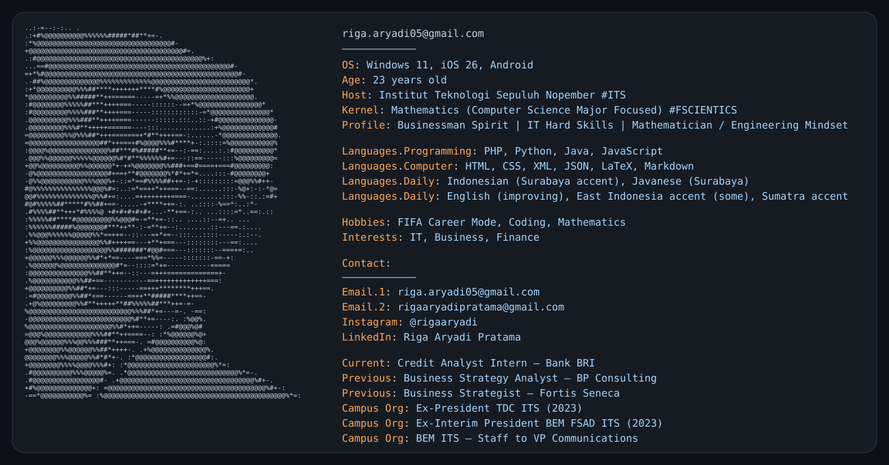

<!-- =========================================================
     RIGA ARYADI PRATAMA — GITHUB PROFILE
     Layout: left-aligned / editorial-terminal style
========================================================= -->

<h1>Riga Aryadi Pratama</h1>

<code><b>Entrepreneur Spirit</b> · IT Hard Skills · Mathematician / Engineering Mindset </code>

 

<!-- PROFILE TERMINAL -->

  <picture>
    <source media="(prefers-color-scheme: dark)" srcset="./dark_mode.svg">
    <source media="(prefers-color-scheme: light)" srcset="./light_mode.svg">
    
  </picture>

 

## `01 / EXPERIENCE`

**Credit Analyst Intern** — Bank BRI  
`CURRENT`

**Business Strategy Analyst** — BP Consulting  
`PREVIOUS`

**Business Strategist** — Fortis Seneca  
`PREVIOUS`

**President** — TDC ITS  
`2023`

**Interim President** — BEM FSAD ITS  
`2023`

**BEM ITS** — Staff → VP Communications

 

## `02 / TECH STACK`

**Programming**  

**Markup / Data**  

 

## `03 / PROFILE`

| | |
|---|---|
| **Education** | Mathematics - Scientics - Institut Teknologi Sepuluh Nopember (ITS) `2021-2026`  |
| **Academic Focus** | Computer Science, Blockchain, Cryptography, Mathematical Modelling and Finance, Technopreneur |
| **Mindset** | Businessman Spirit · IT Hard Skills · Mathematician / Engineering Mindset |
| **Interests** | IT · Business · Finance |
| **Hobbies** | FIFA Career Mode · Coding |
| **Daily Languages** | Indonesian (Surabaya accent) · Javanese (Surabaya) · English (improving) |
| **Accent Familiarity** | Some East Indonesian · Sumatra |
| **OS** | Windows 11 · iOS 26 · Android |

 

## `04 / CONTACT`

`EMAIL` &nbsp; riga.aryadi05@gmail.com  
`EMAIL` &nbsp; rigaaryadipratama@gmail.com  
`INSTAGRAM` &nbsp; @rigaaryadi  
`LINKEDIN` &nbsp; Riga Aryadi Pratama

 

---
Built around mathematics, technology, business, and an engineering way of thinking.
